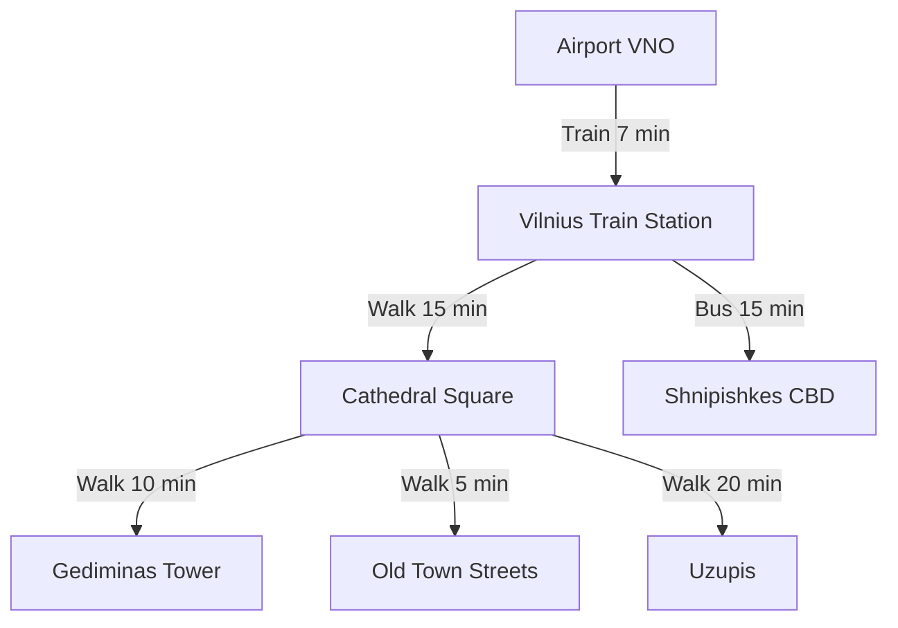

# Getting Around

Vilnius is a compact city and very easy to navigate. The Old Town is almost entirely walkable, and public transport covers the rest efficiently.

---

## From the Airport

Vilnius Airport (VNO) is located just **7 km south** of the city centre — one of the most conveniently located airports in Europe.

| Option | Duration | Cost | Notes |
|---|---|---|---|
| Train | 7 min | €0.65 | Runs every 30 min, most convenient |
| Bus (No. 1, 2) | 30–40 min | €1 | Slower but runs more frequently |
| Bolt / Uber | 15–20 min | €8–12 | Door to door, best late at night |
| Taxi | 15–20 min | €15–25 | Use only licensed taxis |

!!! tip "Best Option"
    The **train** is the fastest and cheapest option. Buy tickets at the station kiosk or via the Trafi app.

---

## Getting Around the City

### Walking
The Old Town is best explored on foot. Most major sights are within a **20-minute walk** of Cathedral Square. Wear comfortable shoes — the cobblestones can be uneven.

### Public Transport
Vilnius has an extensive bus and trolleybus network.

- **Fare:** €1.00 (cash on board) or €0.65 (with an M-Ticket card)
- **Day pass:** €3.00
- **Operating hours:** ~05:30–23:00 (night buses on weekends)
- **App:** Download **Trafi** for real-time routes and schedules

### Bolt Scooters
Electric scooters are available throughout the city via the Bolt app. A fun and cheap way to cover medium distances.

- Unlock fee: €0.50
- Per minute: €0.15

### CycloCity Bike Share
Vilnius has a well-developed cycling infrastructure.

- Available at 60+ stations across the city
- First 30 minutes free with a day pass (€2)
- Great for riverside routes along the Neris

### Car Rental & Taxis

!!! warning "Driving in Old Town"
    Most of the Old Town is a **restricted traffic zone**. You need a permit to drive there. For visiting the Old Town, always use public transport or walk.

- Licensed taxis are metered. Starting fare ~€1.30, ~€0.80/km
- Always use **Bolt** or **Uber** apps to avoid overcharging

---

## Key Routes

