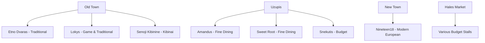

# Best Restaurants

Vilnius has a rapidly evolving restaurant scene that punches well above its size. From traditional Lithuanian cuisine to creative modern cooking, the city offers excellent value compared to Western European capitals.

!!! tip "Booking Advice"
    For mid-range and fine dining restaurants, **book in advance**, especially for Friday and Saturday evenings. Most restaurants accept reservations via their website or by phone.

---

## Traditional Lithuanian

### Etno Dvaras
The most reliable spot for traditional Lithuanian food in the Old Town. Rustic wooden interior, generous portions, and a menu that covers all the classics.

- **Location:** Pilies g. 16, Old Town
- **Price range:** €€
- **Must order:** Cepelinai, kugelis, dark rye bread basket
- **Hours:** Daily 11:00–23:00

### Lokys (The Bear)
One of the oldest restaurants in Vilnius, operating since 1972 in a beautiful Gothic cellar. Specialises in game — wild boar, beaver, and venison alongside Lithuanian classics.

- **Location:** Stikliu g. 8, Old Town
- **Price range:** €€€
- **Must order:** Wild boar stew, hunter's platter
- **Hours:** Daily 12:00–24:00

### Senoji Kibininė
The best place in Vilnius for **kibinai** — the flaky Karaite pastries. Simple, casual, and excellent value.

- **Location:** Bernardinu g. 9, Old Town
- **Price range:** €
- **Must order:** Lamb kibinas, honey beer
- **Hours:** Daily 10:00–21:00

---

## Modern & Fine Dining

### Amandus
One of Vilnius's top fine dining restaurants, serving creative Lithuanian cuisine with high-quality seasonal ingredients. Elegant but not stuffy.

- **Location:** Uzupio g. 20, Uzupis
- **Price range:** €€€€
- **Must order:** Tasting menu (changes seasonally)
- **Hours:** Tue–Sat 18:00–23:00

### Sweet Root
Consistently ranked among the best restaurants in the Baltics. Creative, artistic tasting menus that showcase Lithuanian ingredients in unexpected ways.

- **Location:** Uzupio g. 22, Uzupis
- **Price range:** €€€€
- **Must order:** Chef's tasting menu (advance booking essential)
- **Hours:** Tue–Sat 18:00–22:00

### Nineteen18
Modern European cuisine in a beautifully designed space. Great cocktail bar attached.

- **Location:** Gedimino pr. 13, New Town
- **Price range:** €€€
- **Hours:** Mon–Sat 12:00–23:00

---

## Budget Eats

### Halės Turgus (Hales Market)
Vilnius's main covered market, a short walk from the Old Town. Fresh produce, hot food stalls, and local snacks at very low prices. A great place to eat like a local.

- **Location:** Pylimo g. 58
- **Price range:** €
- **Hours:** Mon–Sat 07:00–18:00, Sun 07:00–15:00

### Snekutis
A beloved neighbourhood bar and canteen serving cheap, hearty Lithuanian food and local beer. Cash only, no frills, completely authentic.

- **Location:** Sv. Stepono g. 8, Uzupis
- **Price range:** €
- **Hours:** Mon–Thu 11:00–22:00, Fri–Sat 11:00–24:00

---

## Price Guide

| Symbol | Price per person (food only) |
|---|---|
| € | Under €10 |
| €€ | €10–25 |
| €€€ | €25–50 |
| €€€€ | €50+ |

---

## Restaurant Map Overview

