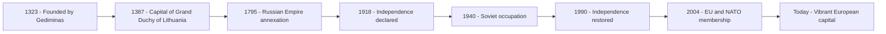

# About This Guide

Welcome to the **Vilnius Travel Guide** — an open, community-friendly documentation site built to help travellers explore one of Europe's most underrated capital cities.

---

## Purpose

This guide aims to be:

- **Practical** — real information you can use on the ground
- **Up to date** — regularly reviewed and updated
- **Honest** — genuine recommendations, not paid placements
- **Accessible** — written in plain English for international visitors

---

## About Vilnius

Vilnius is the capital of Lithuania, a country of 2.8 million people on the eastern shore of the Baltic Sea. Lithuania was the last country in Europe to officially adopt Christianity (1387), and its capital reflects this unique history — a city where pagan traditions, Catholic baroque, Jewish heritage, Soviet modernism, and contemporary European culture all exist side by side.

| Fact | Detail |
|---|---|
| Country | Lithuania |
| Region | Baltic States, Northern Europe |
| EU Member | Since 2004 |
| NATO Member | Since 2004 |
| Population (city) | ~580,000 |
| Area | 401 km² |
| Elevation | 112 m above sea level |
| Founded | ~1323 (by Grand Duke Gediminas) |
| UNESCO status | Old Town listed since 1994 |

---

## A Brief History

---

## How to Contribute

This site is built with **MkDocs** and the **Material theme**, with content written in Markdown. All source files are hosted on GitHub.

If you notice outdated information, incorrect prices, or want to suggest a new restaurant or attraction, contributions are welcome.

### Reporting Issues
- Open an issue on the GitHub repository
- Describe what is incorrect or missing
- Include the page name and section

### Submitting Changes
1. Fork the repository
2. Create a branch: `git checkout -b fix/page-name`
3. Edit the relevant `.md` file in the `docs/` folder
4. Submit a pull request with a clear description

---

## Built With

| Tool | Purpose |
|---|---|
| [MkDocs](https://www.mkdocs.org/) | Static site generator |
| [Material for MkDocs](https://squidfunk.github.io/mkdocs-material/) | Theme |
| [GitHub Pages](https://pages.github.com/) | Hosting |
| Markdown | Content format |

---

!!! note "Disclaimer"
    All prices, hours, and practical information in this guide are approximate and subject to change. Always verify details directly with venues before visiting.
